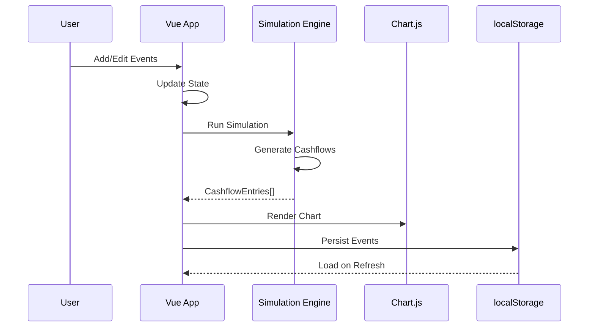

# Cashflow Simulator Architecture

## System Overview

CashflowSim is a client-side Single Page Application (SPA) that runs entirely in the browser with no backend dependencies.

## Component Architecture

```mermaid
graph TB
    subgraph Browser["Browser (Client-Side)"]
        subgraph VueApp["Vue 3 Application"]
            UI[Vue Components<br/>- Events Table<br/>- Chart Display<br/>- Settings Panel]
            State[Vue Reactivity<br/>- simStart<br/>- simEnd<br/>- initialBalance<br/>- events]
            Logic[Simulation Engine<br/>src/cashflow.js]
        end

        subgraph DataLayer["Data Layer"]
            LS[localStorage<br/>Persisted User Data]
        end

        subgraph CDNHooks["CDN Dependencies"]
            Chart[Chart.js 4.5.1<br/>Data Visualization]
            Parse[PapaParse 5.5.3<br/>CSV Import/Export]
            Tailwind[Tailwind 2.2.19<br/>CSS Styling]
        end
    end

    UI --> State
    State --> Logic
    Logic --> Chart
    UI --> Parse
    UI <--> LS
    Parse --> LS
end
```

## Data Flow



## Module Responsibilities

| Module            | Location               | Purpose                                 |
| ----------------- | ---------------------- | --------------------------------------- |
| Simulation Engine | `src/cashflow.js`      | Pure functions for cashflow calculation |
| Unit Tests        | `src/cashflow.test.js` | Vitest tests for simulation logic       |
| Styling           | `src/style.css`        | Custom CSS + Tailwind overrides         |
| Application       | `index.html`           | Vue 3 SPA with CDN dependencies         |

## External Dependencies

| Dependency   | Version | Purpose                           |
| ------------ | ------- | --------------------------------- |
| Vue 3        | CDN     | SPA Framework (Composition API)   |
| Chart.js     | 4.5.1   | Bar + Line mixed chart            |
| PapaParse    | 5.5.3   | CSV import/export                 |
| Tailwind CSS | 2.2.19  | Utility CSS (dark mode via class) |

## Data Storage

All user data is stored locally in the browser's localStorage:

- Simulation parameters (start date, end date, initial balance)
- Event definitions (income/expense entries)
- UI preferences (dark mode, currency)

No data is transmitted to any external server.
